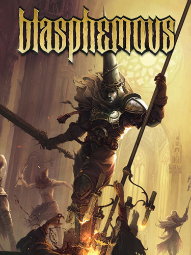

  

# 🎮 Gameplay Testing & QA Analysis Report — Blasphemous
Blasphemous
---

# 1. Game Overview

| Category | Details |
|----------|---------|
| **Genre** | Metroidvania / Action Platformer / Soulslike |
| **Developer** | The Game Kitchen |
| **Publisher** | Team17 |
| **Primary Focus** | Exploration-driven combat, precision platforming, atmospheric storytelling, and punishment-reward gameplay loop |

**Blasphemous** combines challenging melee combat with interconnected world exploration inspired by classic Metroidvania titles. The game heavily emphasizes environmental storytelling, reaction-based combat, enemy pattern recognition, and player punishment for mistakes.

---

# 2. Core Gameplay Loop Analysis

The primary gameplay loop revolves around:

1. Exploring interconnected areas  
2. Fighting enemies and mini-bosses  
3. Learning enemy attack patterns  
4. Unlocking progression paths and abilities  
5. Returning to previously inaccessible locations  
6. Strengthening player capabilities through upgrades and relics  

### The loop remains engaging due to:
- High combat tension  
- Risk of punishment upon failure  
- Rewarding exploration  
- Gradual mastery of mechanics  

The game successfully creates player motivation through environmental mystery and gradual progression rather than excessive tutorials or direct guidance.

---

# 3. Combat System Evaluation

## ✅ Strengths

### Responsive Melee Combat
Combat inputs generally feel responsive and deliberate. Attack chaining, dodging, and parrying create a satisfying rhythm once enemy timings are learned.

### Enemy Pattern Recognition
Enemy encounters reward observation and patience rather than button spamming. Different enemy types force the player to adapt positioning and timing.

### Punishment & Reward Balance
The game maintains tension effectively by heavily punishing reckless gameplay while rewarding mechanical mastery.

### Boss Encounter Design
Boss fights provide strong visual presentation and mechanical uniqueness. Multiple bosses require learning phase transitions and attack telegraphs.

---

## ⚠ Weaknesses

### Animation Lock Frustration
Some attack animations lock the player for slightly longer than expected, occasionally creating situations where damage feels unavoidable.

### Inconsistent Hit Feedback
Certain enemies lack strong visual or audio feedback when attacks connect, reducing combat clarity during chaotic encounters.

### Limited Early Combat Variety
The early game combat loop can temporarily feel repetitive before additional abilities and upgrades are unlocked.

---

# 4. Level Design & Exploration Analysis

## ✅ Strengths

### Interconnected World Structure
The map design strongly encourages exploration and backtracking. Previously inaccessible areas create long-term curiosity and reward player memory.

### Environmental Storytelling
Visual design communicates lore effectively without relying excessively on direct exposition.

### Atmospheric Consistency
Area design, enemy placement, sound effects, and art direction maintain strong thematic consistency throughout progression.

---

## ⚠ Weaknesses

### Navigation Confusion
Certain regions lack sufficient visual landmarks, occasionally causing unnecessary player disorientation.

### Punishing Platforming Sections
Some platforming sequences create frustration due to instant-death hazards combined with precise movement requirements.

---

# 5. UI / UX Evaluation

## ✅ Strengths
- Minimalistic UI maintains immersion  
- Health, mana, and ability indicators remain readable during combat  
- Menu navigation is straightforward and responsive  

---

## ⚠ Weaknesses

### Limited Player Guidance
The intentionally vague progression system may confuse players unfamiliar with Metroidvania design philosophy.

### Map Readability Issues
Some unexplored paths and vertical connections could be visually communicated more clearly.

---

# 6. Audio & Visual Feedback Analysis

## ✅ Strengths

### Art Direction
Pixel art quality is highly detailed and visually distinctive. Enemy and boss designs strongly reinforce the game’s dark religious aesthetic.

### Audio Atmosphere
Ambient music and environmental sound design significantly improve immersion and emotional tone.

### Combat Sound Effects
Weapon impacts and parry sounds effectively communicate successful defensive timing.

---

## ⚠ Weaknesses

### Visual Clutter During Combat
Particle effects and overlapping enemy attacks occasionally reduce readability during high-intensity encounters.

---

# 7. Technical & QA Observations

## Collision & Platforming Observations
- Certain ledge interactions occasionally feel inconsistent during precise jumps  
- Some narrow platform sections may cause unintended collision sliding  

---

## Camera & Visibility Observations
- Camera positioning occasionally limits visibility during vertical combat encounters  
- Enemy attacks from off-screen areas can occasionally feel unfair  

---

## Combat Edge Cases
- Simultaneous enemy collisions may trap the player in unavoidable damage loops  
- Recovery animations after knockback occasionally reduce player control excessively  

---

## Performance Observations
- General performance remained stable during standard gameplay  
- Minor frame pacing inconsistencies were observed during effects-heavy boss encounters  

---

# 8. Difficulty & Balance Evaluation

The game successfully delivers a high-difficulty experience while generally remaining fair.

Most player deaths feel tied to:
- Impatience  
- Incorrect positioning  
- Insufficient enemy understanding  

However:
- Some instant-death platforming hazards create frustration that feels less skill-based than combat-related failures  

The balance between exploration, combat, and progression remains strong throughout most of the experience.

---

# 9. Improvement Suggestions

## 🎮 Gameplay Improvements
- Reduce animation lock duration slightly for better combat fluidity  
- Improve readability of enemy attack telegraphs in crowded encounters  

---

## 🧭 UX Improvements
- Enhance map readability for vertical traversal routes  
- Add optional accessibility guidance for progression direction  

---

## ⚙ Technical Improvements
- Improve collision consistency near narrow ledges  
- Reduce visual clutter during multi-enemy combat scenarios  

---

# 10. Final Evaluation

Blasphemous delivers a strong combination of:
- Atmospheric world design  
- Challenging combat  
- Rewarding exploration  
- Memorable artistic direction  

The game succeeds particularly well in creating tension and player engagement through deliberate combat pacing and environmental storytelling.

While certain platforming frustrations and visibility limitations occasionally affect gameplay clarity, the overall gameplay experience remains highly polished and mechanically satisfying.

---

# 📊 Overall QA / Game Design Assessment

| Category | Evaluation |
|----------|------------|
| Combat Design | Strong |
| Exploration Design | Strong |
| UI/UX Clarity | Moderate |
| Technical Stability | Good |
| Gameplay Feedback | Good |
| Difficulty Balance | Strong |
| Atmosphere & Art Direction | Exceptional |

---

# 📝 Tester Notes

| Detail | Information |
|--------|-------------|
| **Playtime Evaluated** | Multiple sessions across early, mid, and late-game progression |
| **Primary Focus Areas** | Combat responsiveness, exploration design, gameplay clarity, difficulty balance, and technical stability |

---
